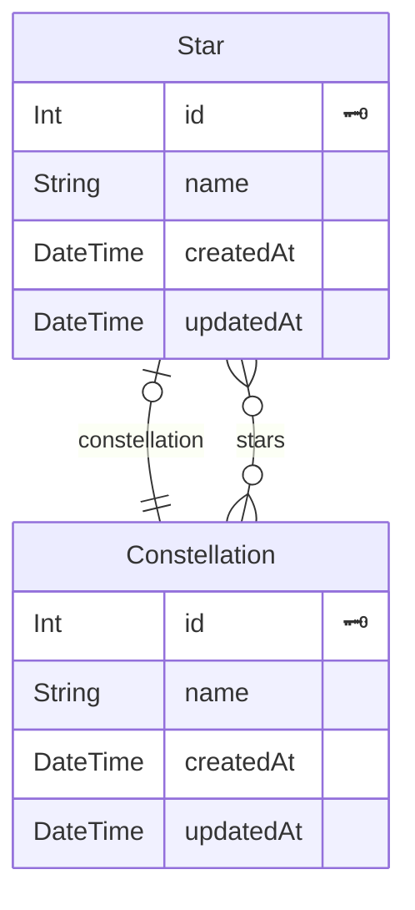

```mermaid
erDiagram

  "Star" {
    Int id "🗝️"
    String name
    DateTime createdAt
    DateTime updatedAt
    }


  "Constellation" {
    Int id "🗝️"
    String name
    DateTime createdAt
    DateTime updatedAt
    }

    "Star" o|--|| "Constellation" : "constellation"
    "Constellation" o{--}o "Star" : "stars"
```
